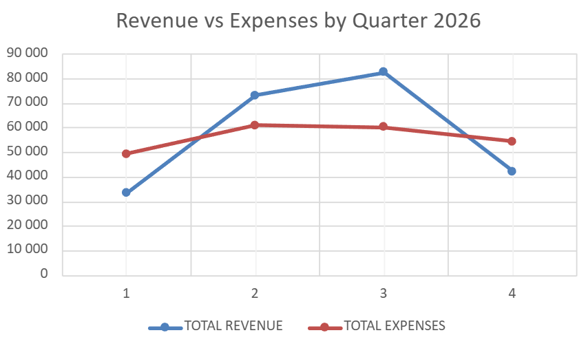
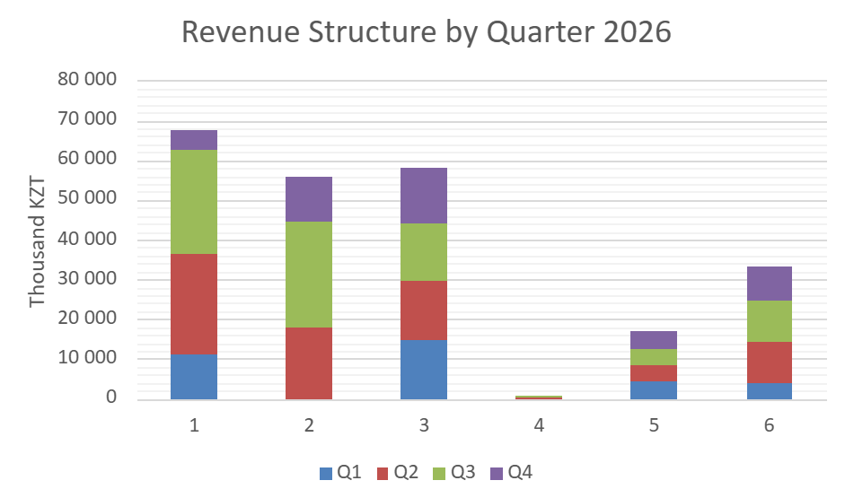
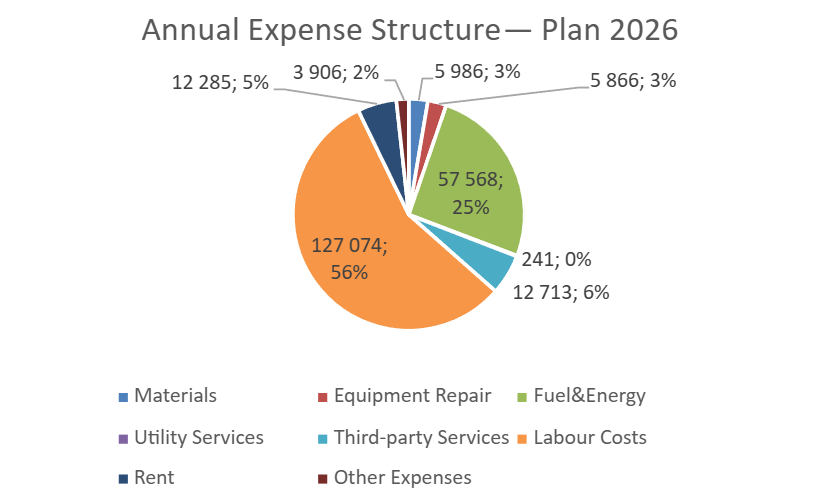

# Quarterly Budget Analysis 2026 — Excel

**Project:** Industrial Internship 1 | SDU University | June 2026  
**Author:** Myrzabek Sagynzhan  
**Tools:** Microsoft Excel (pivot tables · formulas · charts)

> ⚠️ Company name and sensitive details anonymized for portfolio purposes.

---

## Project Goal

Analyze the annual 2026 budget of a construction company by quarter:
- Build **quarterly revenue and expense tables** with financial formulas
- Calculate **Share of Annual Plan %** for each quarter
- Calculate **Net Income (Loss)** per quarter
- Visualize seasonal business patterns across Q1–Q4

---

## Files

| File | Description |
|---|---|
| `Revenue_vs_expenses_by_quarter.png` | Line chart — total revenue vs expenses |
| `Revenue_structure_by_quarter.png` | Stacked bar — revenue breakdown by source |
| `Net_income_by_quarter.png` | Bar chart — profit/loss per quarter |
| `Annual_Expense_structure.png` | Pie chart — annual expense composition |

> Source Excel file not included due to confidentiality.  
> All data and charts are visible in the images below.

---

## Charts

### Revenue vs Expenses by Quarter

### Revenue Structure by Quarter

### Net Income (Loss) by Quarter

### Annual Expense Structure

---

## Key Findings

| Metric | Q1 | Q2 | Q3 | Q4 |
|---|---|---|---|---|
| Total Revenue (K₸) | 33,508 | 73,382 | 82,850 | 42,445 |
| Total Expenses (K₸) | 49,527 | 61,211 | 60,335 | 54,570 |
| Net Income/Loss (K₸) | **−16,019** | **+12,171** | **+22,515** | **−12,125** |

**Key insights:**
- Business is **highly seasonal** — profitable in Q2 and Q3 (construction peak season in Kazakhstan), loss-making in Q1 and Q4 (off-season)
- **Labour Costs dominate** annual expenses at 56% — typical for construction
- **Fuel & Energy** is the second largest expense at 25%
- Q3 is the strongest quarter — revenue peaks at 82,850 thousand KZT

---

## Excel Techniques Used

- Pivot tables for quarterly aggregation
- Financial formulas: `SUM`, `SUMIF`, percentage share calculations
- 4 chart types: line, stacked bar, column (with color coding), pie
- Conditional formatting for positive/negative values (green/red)
